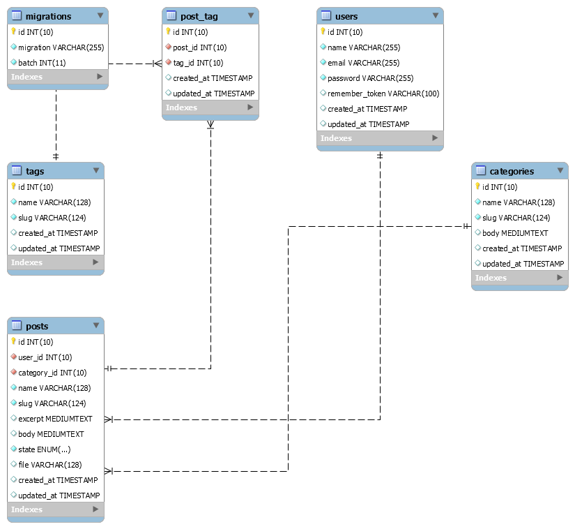

## 🔥 Proyecto de blog
<p align="center"></p>
En este proyecto estaba aprendiendo sobre al framework [Laravel 6](https://laravel.com/docs/6.x).

## 📐 Temas relacionados
* Arquitectura.
* Instalación.
* Configuración.
* Sistema de rutas y tipo de rutas.
* Controladores.
* Validaciones.
* Helpers principales.
* Php artisan.
* HTTP responses & requests.   
* Sistema de autenticación y registro.
* URL amigables con slugs.

## 🗺 MER del proyecto

``` 
	Este proyecto lo realice hace más o menos 2 años.
```
## License 🔥
Copyright © 2019-present [Oscar Amado](https://github.com/ofaaoficial) 🧔


